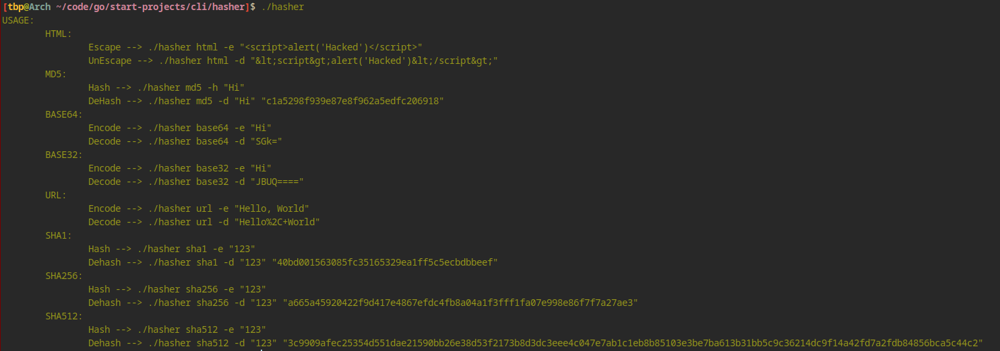

# hasher
An easy to use and fast tool for hashing and encoding stuff

## Features

### hasher supports
- MD5
- BASE64
- BASE32
- HTML Encode/Decode
- URL  Encode/Decode
- SHA1
- SHA256
- SHA512

## How to install it?
```
   git clone https://github.com/shareghzadeh/hasher.git
   cd hasher
```
## How to use it?

1- you need to have `Go Programming Language` to run this program (https://go.dev/)

2- You can create the binery `go build hasher.go` (recommended)

**NOTE:** If you want to run the program without creating binary, use `go run hasher.go`

3- After creating the binary just run it `./hasher` (it is interesting isn't it?)



## Why there is no `help` command?
When you can run the program and get the help why should be a help command?
